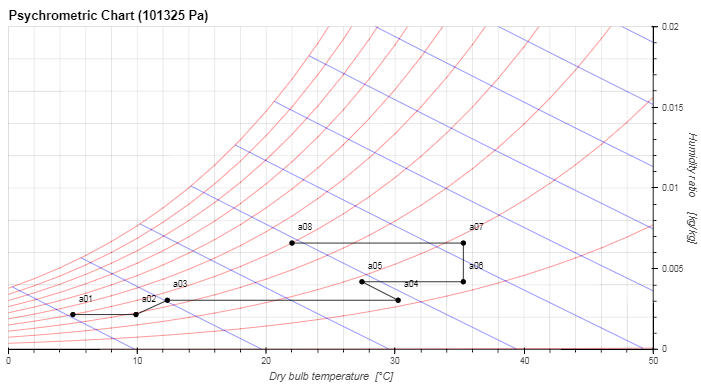

# psychropyo:  Psychrometry using Pyomo

For Pyomo, see:  http://www.pyomo.org/
   
The psychropyo package is a tool for psychrometry calculations.   
It is based on the Pyomo mathematical modeling tool.  
The psychropyo package contains these modules:

* psychrothermo: Pyomo models for thermodynamic properties for air and water   
* psychrostream: Pyomo models for streams of humid air, water, vapor and heat  
* psychroprocess: Pyomo models for simple processes: mix, split, condense, exchange, flowsheetsection, flowsheet    
* psychrochart: module for plotting on a psychrometric chart    
* psychroutils: utilities functions
<iframe src="https://www.linkedin.com/in/michel-jadoul-modelingoptimization/" height="1" width="1" frameBorder="0"></iframe>
